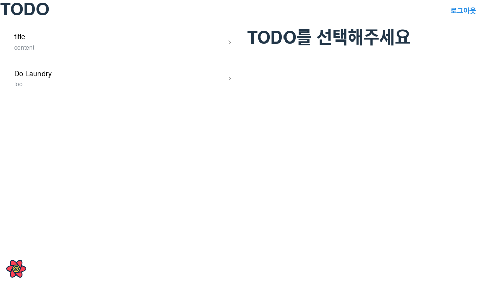
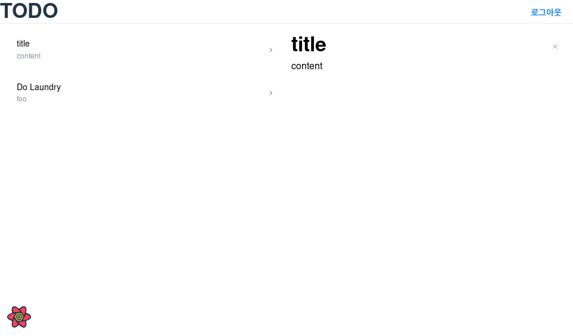
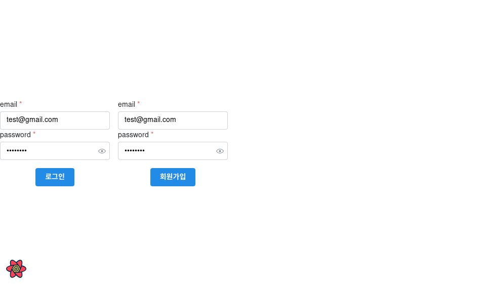

# wanted-pre-onboarding-challenge-fe-1

원티드 프리온보딩 챌린지 프론트엔드 코스 사전과제

## 소개

| 루트          |           스크린샷           |
| ------------- | :--------------------------: |
| `/`           |        |
| `/todos/:id`  |    |
| `/auth/login` |  |
| 404           |         |

## 실행 방법

### 백엔드

[백엔드 api 저장소][백엔드]를 `git clone` 한 후, 아래 명령 중 하나를 실행합니다.

```sh
yarn install && yarn run start
pnpm install && pnpm run start
```

[백엔드]: https://github.com/zerohyunkim/wanted-pre-onboarding-challenge-fe-1-api

### 프론트엔드

이 저장소를 `git clone` 한 후, 아래 명령 중 하나를 실행합니다.

```sh
yarn install && yarn run dev
pnpm install && pnpm run dev
```

## [구현 목록][구현 목록]

[구현 목록]: https://github.com/zerohyunkim/wanted-pre-onboarding-challenge-fe-1-api/blob/master/README.md#1-2-클라이언트-구현-과제-안내

### Assignment 1 - Login / SignUp

- /auth 경로에 로그인 / 회원가입 기능을 개발합니다
  - 로그인, 회원가입을 별도의 경로로 분리해도 무방합니다
  - [x] 최소한 이메일, 비밀번호 input, 제출 button을 갖도록 구성해주세요
- 이메일과 비밀번호의 유효성을 확인합니다
  - [x] 이메일 조건 : 최소 `@`, `.` 포함
  - [x] 비밀번호 조건 : 8자 이상 입력
  - [x] 이메일과 비밀번호가 모두 입력되어 있고, 조건을 만족해야 제출 버튼이 활성화 되도록 해주세요
- 로그인 API를 호출하고, 올바른 응답을 받았을 때 루트 경로로 이동시켜주세요
  - [x] 응답으로 받은 토큰은 로컬 스토리지에 저장해주세요
  - [x] 다음 번에 로그인 시 토큰이 존재한다면 루트 경로로 리다이렉트 시켜주세요
  - [ ] 어떤 경우든 토큰이 유효하지 않다면 사용자에게 알리고 로그인 페이지로 리다이렉트 시켜주세요

### Assignment 2 - Todo List

- Todo List API를 호출하여 Todo List CRUD 기능을 구현해주세요
  - [x] 목록 / 상세 영역으로 나누어 구현해주세요
  - [x] Todo 목록을 볼 수 있습니다.
  - [ ] Todo 추가 버튼을 클릭하면 할 일이 추가 됩니다.
  - [ ] Todo 수정 버튼을 클릭하면 수정 모드를 활성화하고, 수정 내용을 제출하거나 취소할 수 있습니다.
  - [ ] Todo 삭제 버튼을 클릭하면 해당 Todo를 삭제할 수 있습니다.
- 한 화면 내에서 Todo List와 개별 Todo의 상세를 확인할 수 있도록 해주세요.
  - [x] 새로고침을 했을 때 현재 상태가 유지되어야 합니다.
  - [x] 개별 Todo를 조회 순서에 따라 페이지 뒤로가기를 통하여 조회할 수 있도록 해주세요.
- 한 페이지 내에서 새로고침 없이 데이터가 정합성을 갖추도록 구현해주세요
  - [x] 수정되는 Todo의 내용이 목록에서도 실시간으로 반영되어야 합니다

## 사용 기술

선택 조건:

- 가벼운가?
- 사용하기 편리한가?
- 타입스크립트로 작성되었나?
- 최근 유지보수되고 있나?

### 컴포넌트 UI: [mantine][mantine]

```tsx
<TextInput value={value} onChange={e => setValue(event.currentTarget.value)} />
```

- 필수 컴포넌트 기능 (`Grid`, `Table`, `Input` 등등)
- 폼 라이브러리

### 컴포넌트 스토리북: [ladle][ladle]

```ts
// World.story.ts
export const World = () => <p>Hello</p>
```

- vite와 호환됨
- 초기 설치 필요 없음 (storybook: 30초+)
- 매우 빠름 (< 500ms)

### 상태 관리: [jotai][jotai]

```ts
const nameAtom = atom('renk')
const capital = (s: string) => s.charAt(0).toUpperCase() + s.slice(1)
const capitalAtom = atom(get => capital(get(nameAtom)))

const App = () => <h2>Hello, {useAtomValue(capitalAtom)}!</h2>
```

- recoil보다 간결한 문법
- 반응형 상태를 쉽게 관리할 수 있음

### HTTP 요청: [ky][ky]

```ts
export const createTodo = (json: TodoInput) =>
  ky.post(`${url}/todos`, { ...options, json }).json<TodoResponse>()
```

- `XHRRequest (axios)`가 아닌 `fetch` 사용
- 유지보수가 빠름: [하루 안에 답변](https://github.com/sindresorhus/ky/issues/481#issue-1526642037)

### 비동기 상태 관리: [react query][react query]

- 쿼리 상태 관리, 변경, 갱신을 쉽게 할 수 있음

### 라우팅: [react-router-dom(v6)][react-router-dom(v6)]

- [공식 문서](https://reactrouter.com/en/main)가 잘 정리되어 있음

### 코드 스타일 및 린터: [rome][rome]

- 빠름
- 스타일과 코딩 컨벤션을 [단일 파일](rome.json)에서 관리 가능

[ky]: https://github.com/sindresorhus/ky
[jotai]: https://jotai.org
[react query]: https://tanstack.com/query/latest/docs/react/overview
[react-router-dom(v6)]: https://github.com/remix-run/react-router
[mantine]: https://mantine.dev
[ladle]: https://github.com/tajo/ladle
[rome]: https://rome.tools/

## 폴더 구조

구분 기준: 관련된 동작 위주로 분류

```
src
├── api (백엔드 통신용 HTTP API)
├── components
│   ├── hoc (고차 컴포넌트 래퍼 Higher Order Component)
│   └── todo (Todo관련 컴포넌트들)
├── queries (리액트 쿼리 후크)
├── routes (라우팅 테이블)
├── types (전역 타입 정의)
└── utils (로컬스토리지, 문자열 줄임표 등 유틸리티 함수)
```
